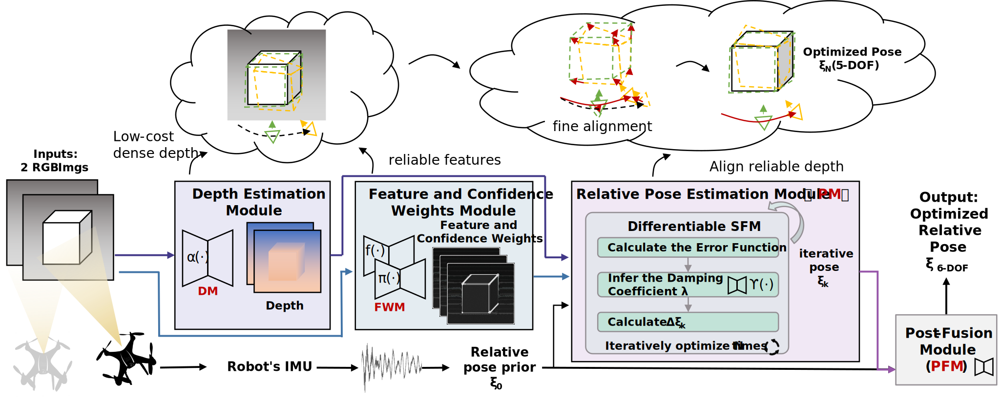
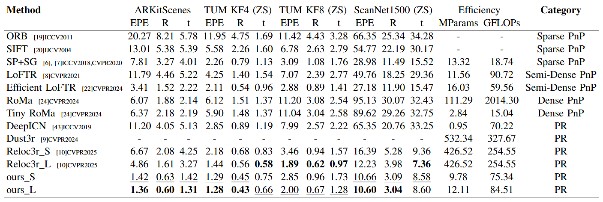
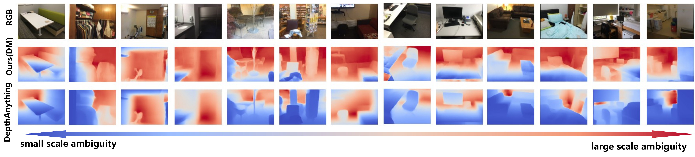

<p align="center">
  <h2 align="center">LDGC-VIS: A Lightweight End-to-end Monocular Visual-Inertial Pose Estimation Framework</h2>
</p>

<p align="center">
  <a href="">
    
  </a>
</p>

<p align="center">
<strong>LDGC-VIS</strong> is a lightweight end-to-end visual-inertial fusion pose estimation method, tailored for micro- and nanoscale unmanned systems.Its network design with explicit geometric constraints and aiming to balance localization accuracy and computational efficiency.
</p>
<br>

<p align="center">
  <a href="">
    
  </a>
</p>
<p align="center">
  <a href="">
    
  </a>
</p>

<p align="center">
The LDGC-VIS-L model contains only 12.1M parameters, which is about one thirty fifth of the size of Reloc3r, yet it improves accuracy by 11.1% on TUM and 13.3% on ScanNet in zero shot evaluation. Even with fewer parameters and limited training data, LDGC-VIS consistently delivers higher accuracy, better generalization, and faster inference.
</p>
<be>


## Table of Contents

- [TODO List](#todo-list)
- [Installation](#Installation)
- [Inference](#Inference)
- [key visualization](#Raw-data-and-key-visualization)
- [Key module visualization ](#Key-module-visualization )
- [Interpretability (DM & FWM)](#Interpretability-dm--fwm)
- [Eval](#Eval)
- [Comparison](#comparison)
- [Train](#Train)
- [Acknowledgments](#Acknowledgments)


## TODO List

- [ x ] Release pre-trained weights and inference code. 
- [ x ] Release the original drawing code and raw data from the paper. 
- [ x ] Release the key module visualization code for the LDGC-VIS on the Arkitscenes, TUM, and ScanNet1500 datasets.
- [   ] Release evaluation code for Arkitscenes, TUM and ScanNet1500 datasets. 
- [   ] Release comparison code with reloc3r, LoFTR, ORB, and SIFT
- [   ] Release training code and data.


## Installation

1. Clone LDGC-VIS
```bash
git clone --recursive https://github.com/scarlet-tt-tt/LDGC-VIS.git
cd LDGC-VIS


2. Create the environment using conda
```bash
# This section is similar to the environment setup for reloc3r. If you have already set up reloc3r, you can run it directly in the reloc3r environment with only minor modifications.
conda create -n LDGC-VIS python=3.11 cmake=3.14.0
conda activate LDGC-VIS 
conda install pytorch torchvision pytorch-cuda=12.1 -c pytorch -c nvidia  # use the correct version of cuda for your system
pip install -r requirements_reloc3r.txt
# add support for LDGC-VIS
pip install -r requirements_addition.txt
```

## Inference

Using LDGC-VIS, you can estimate camera poses for images you captured. 

In this example, we assume the input pose to be 0. The results are only for demonstration purposes and do not represent the accuracy of this model.

You can also modify the `v1_path` and `v2_path` to infer depth for other images.

```bash
python infer_pose.py
```

LDGC-VIS also pre-trains a lightweight depth estimation module (DM) to infer the environmental depth of images, requiring only 1.49M model parameters.

The results of running the program on `data/7Scenes_fire.png` and `data/7Scenes_pumpkin.png` are shown in `data/7Scenes_fire_depth.png` and `data/7Scenes_pumpkin_depth.png`.

You can also modify the `img_path` to infer depth for other images.
```bash
python infer_depth.py --img_path data/7Scenes_fire.png --output_folder data/
```

## Raw data and key visualization
The raw data for robustness analysis is saved in the `raw_data/Robustness_evaluation` folder.  
Run `robustness_evaluation.py` to generate Figure 5 from the paper. The results are shown in `raw_data/Robustness_evaluation/robustness_evaluation_above.png` and `raw_data/Robustness_evaluation/robustness_evaluation_below.png`
```bash
python robustness_evaluation.py
```

The raw data for trajectory comparison on the TUM dataset is saved in the `raw_data/tra_TUM` folder.
Run `tra_TUM.py` to generate Figure 4 from the paper. The results are shown in `raw_data/tra_TUM/combined_trajectories.png`
```bash
python tra_TUM.py
```

## Key module visualization 
To gain further insight into the learned representations, the outputs of the FWM module are visualized in terms of feature maps and weight maps.

First, you need to prepare the [ARKitScenes](https://github.com/apple/ARKitScenes), [TUM](https://cvg.cit.tum.de/data/datasets/rgbd-dataset/download), and [ScanNet1500](https://drive.google.com/drive/folders/16g--OfRHb26bT6DvOlj3xhwsb1kV58fT?usp=sharing) datasets. We follow the data processing methods used in DUSt3R and reloc3r.

Prepare the [croco](https://github.com/naver/croco) and [reloc3r](https://github.com/ffrivera0/reloc3r) repositories and place them in the `croco` and `reloc3r` folders, respectively.

For example, for ScanNet1500, place the dataset in the `data/scannet1500` folder and run the following command. You will obtain the visualization results of the FWM module in the `data/visual_FWM/` directory. The results are already available in `data/visual_FWM/`. If you prefer not to run the program yourself, you can directly view the results.

```bash
python visual_key_module.py --max_num 10
```

## Interpretability (DM & FWM)

### DM (Depth Module)
The zero-shot performance of the pretrained depth estimation network is visualized below, based on the DM right after pretraining (before end-to-end joint adaptation for downstream pose estimation).  
Preview image: `media/DM_V.png` (original vector file: [media/DM_V.pdf](media/DM_V.pdf)).

<p align="center">
  
</p>

In unseen environments, the pretrained DM preserves coherent scene geometry and captures relative spatial ordering, while maintaining low computational cost (0.609 GFLOPs).

### FWM (Feature Weighting Module)
The outputs of the FWM module are visualized as feature and weight maps below.  
Preview image: `media/FWM_3.png` (original vector file: [media/FWM_3.pdf](media/FWM_3.pdf)).

<p align="center">
  
</p>

FWM emphasizes stable indoor structural cues (e.g., walls and architectural outlines), and suppresses dynamic or ambiguous regions (e.g., doors, swivel chairs). It also down-weights hard-to-match or scale-ambiguous objects (e.g., bags, quilts, plastic bags), improving robustness of feature selection.

## Eval
You can run the `evaluate_A.py` function to obtain results similar to those in the paper.
```bash
python evaluate_A.py
```
You can modify the parameters in the `main` function to change the dataset type, model size, and pre-trained parameters for testing. The specific locations for modification are indicated in the code comments.

It is worth noting that the results may vary slightly across different devices. For example, when we re-tested LEM_SFM_S on an RTX 4090, we obtained better results compared to those on an A100:
```
  3D EPE  axis error  trans error  total frames
0  8.168709    3.481148     2.717892        1500.0
```

## Comparison
First, load the comparison models into their respective folders:  
[reloc3r](https://github.com/ffrivera0/reloc3r) into `/reloc3r`  
[SuperGlue](https://github.com/magicleap/SuperGluePretrainedNetwork) into `/SpSg`  
[LoFTR](https://github.com/zju3dv/LoFTR) into `/LoFTR`  

Similarly, you can run the `evaluate_A.py` function to obtain results similar to those in the paper. Simply modify the `main` function to adjust the dataset type, model size, and pre-trained parameters.

```bash
python evaluate_A.py
```

## Train
TODO

## Acknowledgments

Thanks to these great repositories: [Croco](https://github.com/naver/croco), [DUSt3R](https://github.com/naver/dust3r), [reloc3r](https://github.com/ffrivera0/reloc3r),[starnet](https://github.com/ma-xu/Rewrite-the-Stars),[deepICN](https://github.com/lvzhaoyang/DeeperInverseCompositionalAlgorithm), [deeplab v3](https://github.com/fregu856/deeplabv3) and many other inspiring works in the community.
